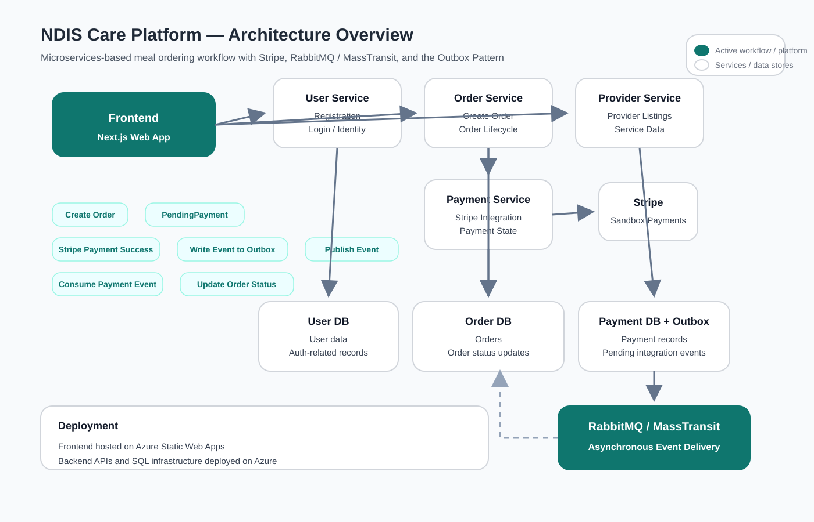

# NDIS Care Platform Frontend

This repository contains the frontend application for the NDIS Care Platform, a demo full-stack project for NDIS meal ordering and service booking.

## Live Demo

- Frontend: https://nice-glacier-0b761a000.7.azurestaticapps.net/

## Overview

The frontend is built to support the main user-facing workflows:

- browse services and providers
- register and log in
- create orders
- complete Stripe sandbox payment
- view order history in My Orders
- view a Technical Overview page for project architecture highlights

## Tech Stack

- Next.js
- TypeScript
- Tailwind CSS

## Main Pages

- Home
- Find Services
- Provider / service selection
- User Login
- User Signup
- My Orders
- Technical Overview

## Backend Integration

This frontend integrates with backend services responsible for:

- user authentication
- order creation and order status management
- payment processing
- provider and service data

## Architecture Context

This frontend is part of a larger full-stack system with separate backend services for user, order, payment, and provider domains.

## Notes

This is a portfolio/demo project built to demonstrate full-stack product and engineering capabilities.